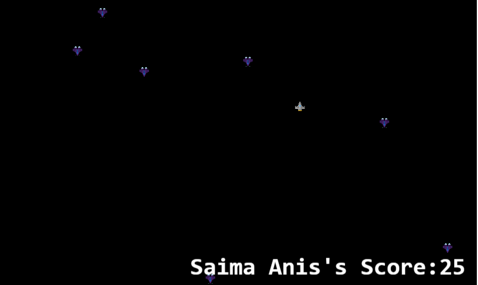

# Shooter Game - Phaser 3 
# [Live Link](https://sad-meninsky-a05fa0.netlify.app/)

A    capstone project for Javascript Module

A Game in which the player shoots enemies and gains points. If the player crashes into an enemy the game ends.


## Game Design and Instructions

- Play as a spacecraft shooting oncoming enemy spaceships.
- Gain 5 points for every enemy ship shot.
- The only way to survive is to avoid crashing into any of the oncoming enemy spaceships.

## Game Controls
To control the spacecraft, use the up/down/left/right arrow keys on the keyboard.

- Press the up arrow key to move the craft upwards.
- Press the down arrow key to move the craft downwards.
- Press the left arrow key to move the craft left.
- Press the right arrow key to move the craft right.

## Built With

- JavaScript
- LeaderBoard API
- Phaser 3
- webpack
- Jest

## Getting Started

To get a local copy up and running follow these simple example steps.

- Clone this project by typing ```git clone git@github.com:saimaAnis21/ShooterGame-JSCapstone.git```
- cd into ShooterGame-JSCapstone
- Run git pull origin main
If you want to repack the file
- Run npm install on the terminal to install dependencies
- Run npm run build to pack the files in the src folder
- Run ```npm run start``` to open it on a live server
Else
- Just Go to the dist folder and open index.html

To run the test

- Run ```npm test``` to run the tests.

#  The Space Shooter - Game Design
This is a game where you play the role of a spacecraft and shoot as many enemy ships as possible without colliding into an enemy ship.

## Movement 
- The player can move the spacecraft up, down, left, or right using the up, down, left, right arrow keys.
- The enemy ships appear at random positions throughout the game.

## Scores 
- A player collects points as he/she shoots the enemyships. 
- Each shot is worth 5 points, so to win shoot as many enemy ships as possible.

## Game Over 
- The game ends when the player's spacecraft collides into an enemy ship. 
- The score is saved and can be viewed on the scoreboard. 
- The player is prompted to retry to play the game again.

## Future additions 
In the future, I will try to enhance the game by
- Increasing the speed of the spaceship.
- Adding more variety of enemy ships.
- Granting more than one life to the player in the game.

## Author

👤 **Saima**

- GitHub: [@saimaAnis21](https://github.com/saimaAnis21)
- Twitter: [@SheTALKS](https://twitter.com/SheTALKS6)
- LinkedIn: [Saima Anis](https://www.linkedin.com/in/saima-anis-3a07921b2/)

## Acknowledgements
- Microverse
- Phaser 3

## 🤝 Contributing

Contributions, issues, and feature requests are welcome!


## Show your support

Give a ⭐️ if you like this project!

## 📝 License

Copyright 2020 Saima Anis

Permission is hereby granted, free of charge, to any person obtaining a copy of this software and associated documentation files (the "Software"), to deal in the Software without restriction, including without limitation the rights to use, copy, modify, merge, publish, distribute, sublicense, and/or sell copies of the Software, and to permit persons to whom the Software is furnished to do so, subject to the following conditions:

The above copyright notice and this permission notice shall be included in all copies or substantial portions of the Software.

THE SOFTWARE IS PROVIDED "AS IS", WITHOUT WARRANTY OF ANY KIND, EXPRESS OR IMPLIED, INCLUDING BUT NOT LIMITED TO THE WARRANTIES OF MERCHANTABILITY, FITNESS FOR A PARTICULAR PURPOSE AND NONINFRINGEMENT. IN NO EVENT SHALL THE AUTHORS OR COPYRIGHT HOLDERS BE LIABLE FOR ANY CLAIM, DAMAGES OR OTHER LIABILITY, WHETHER IN AN ACTION OF CONTRACT, TORT OR OTHERWISE, ARISING FROM, OUT OF OR IN CONNECTION WITH THE SOFTWARE OR THE USE OR OTHER DEALINGS IN THE SOFTWARE.
